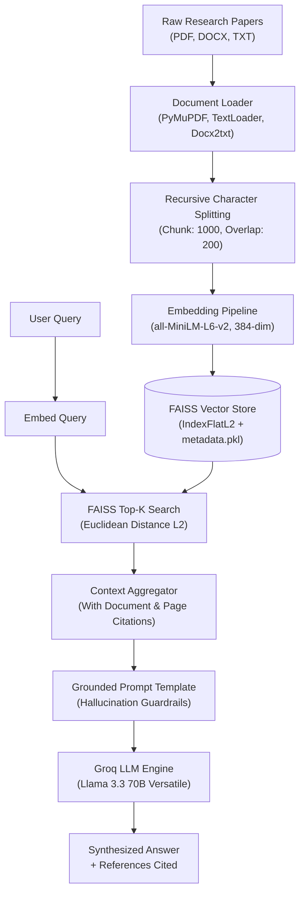

# 📚 Academic Research Paper RAG Assistant

A modular, production-ready **Retrieval-Augmented Generation (RAG)** pipeline designed to ingest, index, and query scientific literature and multi-format research documents. Built with **LangChain**, **FAISS**, **Sentence-Transformers**, and **Groq** (Llama 3.3 70B) for ultra-low latency, grounded Q&A with precise source citations.

---

## 🌟 Key Highlights

- **Multi-Format Ingestion**: Ingests academic papers in PDF (`PyMuPDF`), Word (`docx`), Text (`txt`), CSV, Excel, and JSON formats.
- **Granular Source Attribution**: Preserves document-level metadata (filename, page numbers) to provide verifiable inline citations (`[1]`, `[2]`) in every generated answer.
- **Local Dense Vector Indexing**: Encodes semantic chunks into 384-dimensional embeddings using `sentence-transformers/all-MiniLM-L6-v2` and indexes them locally with **FAISS `IndexFlatL2`**.
- **Low-Latency LLM Synthesis**: Connects to the **Groq LPU Inference Engine** running `llama-3.3-70b-versatile` to provide sub-second synthesis.
- **Hallucination Mitigation**: Uses strict prompt constraints requiring the model to rely solely on retrieved context and explicitly declare when evidence is missing.
- **Interactive CLI & Python API**: Ready-to-demo CLI with live Q&A, re-indexing capabilities, and headless query execution.

---

## 🏗️ Architecture & Pipeline Flow



---

## 📁 Repository Structure

```
RAG/
├── data/                  # Place raw research papers (PDF, TXT, DOCX, etc.) here
├── faiss_store/           # Persisted FAISS index (faiss.index) and metadata (metadata.pkl)
├── src/
│   ├── __init__.py        # Package initialization
│   ├── data_loader.py     # Multi-format document loading and parsing
│   ├── embedding.py       # Chunking (RecursiveTextSplitter) & embedding generation
│   ├── vectorstore.py     # FAISS IndexFlatL2 management, indexing & similarity search
│   └── search.py          # Groq LLM integration, citation formatting & prompt orchestration
├── app.py                 # Quick execution script for demonstration
├── main.py                # Full-featured interactive CLI for querying and re-indexing
├── requirements.txt       # Project dependencies
├── .env.example           # Environment variables template
└── README.md              # Project documentation
```

---

## ⚙️ Installation & Setup

### 1. Prerequisites
- Python 3.10+
- A free [Groq Cloud API Key](https://console.groq.com/keys)

### 2. Clone and Setup Environment

```bash
# Clone the repository
git clone https://github.com/your-username/rag-paper-assistant.git
cd rag-paper-assistant

# Create a virtual environment
python -m venv .venv

# Activate virtual environment
# Windows (PowerShell):
.venv\Scripts\Activate.ps1
# Linux / macOS:
source .venv/bin/activate

# Install dependencies
pip install -r requirements.txt
```

### 3. Configure Environment Variables

Create a `.env` file in the root directory:

```env
GROQ_API_KEY="your_groq_api_key_here"
```

---

## 🚀 Usage

### 1. Add Research Papers
Drop your research papers (e.g. `attention_is_all_you_need.pdf`, `llama3_paper.pdf`) inside the `data/` folder.

### 2. Launch Streamlit Web Dashboard
Launch the interactive web frontend with full pipeline inspection:

```bash
streamlit run streamlit_app.py
```
*(Or with uv: `uv run streamlit run streamlit_app.py`)*

### 3. Run Interactive CLI
Launch the terminal assistant for live multi-turn research questions:

```bash
python main.py
```

### 3. Force Re-Indexing
Rebuild your vector store whenever new papers are added:

```bash
python main.py --reindex
```

### 4. Headless Single Query
Ask a direct query from the command line:

```bash
python main.py --query "How does multi-head attention improve representation learning?" --top_k 3
```

### 5. Programmatic Python Usage

```python
from src.search import RAGSearch

# Initialize search engine (loads FAISS index and Groq LLM)
rag = RAGSearch(persist_dir="faiss_store")

# Query the literature
response = rag.search_and_summarize("What datasets were used for pre-training?", top_k=3)
print(response)
```

---

## 🧠 Technical Design Decisions (Interview Insights)

| Decision | Implementation | Rationale & Trade-offs |
| :--- | :--- | :--- |
| **Vector Index** | `faiss.IndexFlatL2` | Exact Euclidean distance calculation ensures zero recall degradation on datasets up to $10^5$ chunks. For normalized embeddings, $L_2$ ordering is monotonically equivalent to Cosine similarity. |
| **Embedding Model** | `all-MiniLM-L6-v2` | Lightweight 384-dimensional model offering high inference speed on CPU with strong semantic coverage across academic benchmarks. |
| **Chunking Strategy** | Recursive Character Split (`1000` / `200`) | Balances context length with embedding model token limits (~256 tokens) while overlap maintains continuity across paragraphs and sections. |
| **Inference Provider** | Groq (`llama-3.3-70b-versatile`) | Groq's Tensor Streaming Processing Units (LPUs) provide near-instant time-to-first-token (TTFT) and high token generation throughput (~200+ tokens/sec). |
| **Attribution** | Chunk-Level Metadata Persistence | Stores `source` filepath and 1-indexed `page` numbers directly in `metadata.pkl`, preventing ungrounded claims. |

---

## 🛣️ Production Roadmap & Scalability

1. **Layout-Aware PDF Ingestion**: Integrate [Marker](https://github.com/VikParuchuri/marker) or [Nougat](https://github.com/facebookresearch/nougat) to parse two-column layouts, tables, and LaTeX equations into Markdown before chunking.
2. **Hybrid Retrieval (Dense + Sparse)**: Combine FAISS dense vectors with **BM25** using **Reciprocal Rank Fusion (RRF)** to support exact keyword / acronym searches alongside semantic search.
3. **Cross-Encoder Reranking**: Introduce a lightweight reranker (`bge-reranker-large` or Cohere Rerank) on the top-20 retrieved candidates to elevate precision.
4. **Quantitative Evaluation Framework**: Integrate **RAGAS** to track quantitative metrics:
   - *Faithfulness* (hallucination detection)
   - *Answer Relevance* (query alignment)
   - *Context Recall / Precision* (retrieval quality)

---

## 📄 License
This project is open-source and available under the [MIT License](LICENSE).

